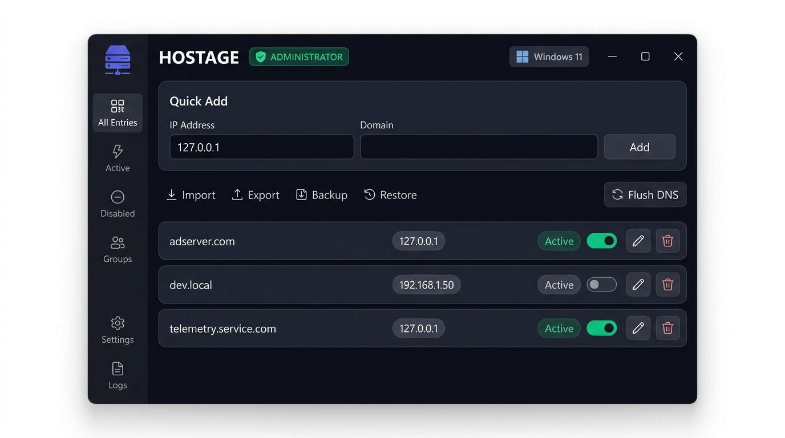
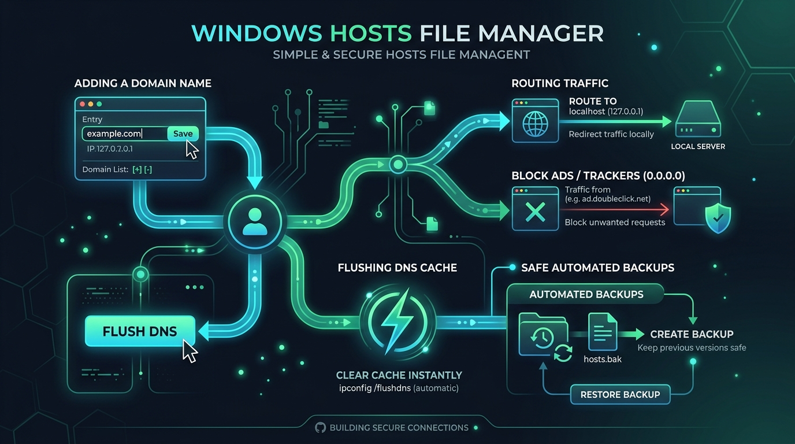

<div align="center">

# 🛡️ HOSTAGE
### Ultra-Lightweight & Portable Windows Hosts File Manager

*Effortlessly manage, toggle, and route domain names in your Windows hosts file with modern UI, zero dependencies, and instant DNS cache flushing.*

<br/>

[](https://github.com)
[](https://github.com)
[-10B981?style=for-the-badge&logo=files&logoColor=white)](https://github.com)
[](https://github.com)
[](LICENSE)

<br/>



</div>

<br/>

---

## 💡 Why Hostage?

Modifying the Windows `hosts` file (`C:\Windows\System32\drivers\etc\hosts`) has historically been cumbersome:
- ❌ Opening Notepad manually as Administrator.
- ❌ Navigating obscure system directories.
- ❌ Accidentally destroying comments or breaking file structure.
- ❌ Manually launching Command Prompt to run `ipconfig /flushdns` every time.
- ❌ Deleting entire lines when you only want to temporarily disable a domain.

**Hostage solves all of this.** It is an ultra-fast, native Win32/GDI+ application in a **single 337 KB `.exe` file** that requires **no installation, no extra DLLs, and no .NET runtime**.

---

## ⚡ How It Works

<div align="center">
  
</div>

<br/>

### 1. Automatic UAC Elevation 🛡️
The Windows hosts file is protected by System permissions. Hostage embeds a `requireAdministrator` manifest so Windows automatically prompts for elevation on launch. You never have to right-click *"Run as administrator"*.

### 2. Intelligent Non-Destructive Parsing 📝
- **Active Mappings**: Parsed into editable rows (`127.0.0.1 domain.com`).
- **Disabled Entries**: Automatically detects lines prefixed with `#` as temporarily disabled records (`# 127.0.0.1 domain.com`).
- **Preserved Content**: Copyright comments, empty lines, and custom headers are left completely intact.

### 3. Single-Click Enable / Disable Toggle 🔘
Turn any domain routing on or off with an intuitive Fluent/iOS-style toggle switch. No need to delete lines or comment them out by hand.

### 4. Instant Windows DNS Cache Flushing ⚡
Whenever changes are saved, Hostage directly calls `DnsFlushResolverCache()` from `dnsapi.dll` and executes `ipconfig /flushdns` in the background. Your browser and network stack immediately pick up changes without needing a system reboot.

### 5. Domain Groups & Section Organization 📁
Organize domains into logical groups like **Development**, **AdBlock**, **Privacy**, or custom projects:
- **Add, Rename & Edit Groups**: Create new groups and rename existing ones at any time via the `Groups...` manager.
- **Assign Domains to Groups**: Click any domain's group badge to quickly reassign it to another group, or select from the dropdown when editing/adding.
- **Safe Group Removal (Zero Data Loss)**: When a group is deleted, all its domains and IPs **automatically revert to 'Ungrouped' and are NEVER deleted**.
- **1-Click Group Toggling**: Visual group section headers feature a `Toggle Group` button to activate or disable an entire group of domains simultaneously.
- **Group Filter Dropdown**: Quickly isolate any single group or view all groups with one click (`[All Groups v]`).

### 6. Automatic Safety Backups 🔄
Before saving any modifications, an automated timestamped backup is generated (`hosts.bak_YYYYMMDD_HHMMSS`). If anything ever goes wrong, click **Backups** to restore any previous version with a single click.

---

## ✨ Features at a Glance

| Feature | Description |
|---|---|
| **📦 100% Portable** | Single standalone `.exe` (only **~387 KB**). Zero installer, zero dependencies, zero leftover registry keys. |
| **📁 Domain Grouping** | Categorize mappings by group (`Dev`, `AdBlock`, etc.) with section headers and 1-click group toggling. |
| **🪟 Windows 7 to 11** | Full compatibility with Windows 7 SP1, 8, 8.1, 10, and 11. Auto-detects OS edition and build version. |
| **⚡ Quick IP Presets** | One-click chips for `127.0.0.1`, `0.0.0.0`, `[Dev]`, `[AdBlock]`, and `[Privacy]`. |
| **🔍 Real-Time Search** | Filter hundreds of entries instantaneously by domain name, IP address, group, or inline comment. |
| **🎯 Filter Tabs & Groups** | Switch between `All`, `Active`, `Disabled`, and filter by specific groups (`[All Groups v]`). |
| **⚡ Bulk & Group Actions** | `Enable All`, `Disable All`, and per-group `Toggle Group` buttons for rapid batch testing. |
| **✏️ In-Place Editor** | Quickly edit host mappings, assign new groups, update IPs, or add helpful comments. |
| **📄 Notepad Integration** | Open the raw hosts file in Windows Notepad with a single click. |
| **🎨 Modern Dark UI** | Sleek obsidian aesthetic (`#12131A`), rounded slate cards, emerald active badges, and Segoe UI typography. |

---

## 🖥️ User Interface Tour

```
┌─────────────────────────────────────────────────────────────────────────────────────────┐
│ 🛡️ HOSTAGE  Hosts File Manager & Domain Groups    [ADMINISTRATOR]  [Windows 11 Build 22631]│
├─────────────────────────────────────────────────────────────────────────────────────────┤
│  [127.0.0.1]  [0.0.0.0]  [General]  [Dev]  [AdBlock]  [Privacy]                         │
│  [ 127.0.0.1    ] [ domain.com            ] [ Dev     ] [ Optional Comment ] [+ Add]    │
├─────────────────────────────────────────────────────────────────────────────────────────┤
│  [All (14)]  [Active (11)]  [Disabled (3)]  [All Groups v] [Groups...] [Enable All] [Dis]│
│  [Search domains, IPs, groups...                                                      ] │
├─────────────────────────────────────────────────────────────────────────────────────────┤
│ 📁 Development (3 entries - 2 active)                                     [Toggle Group]│
│  [●] [ACTIVE]   127.0.0.1   [Dev]      mysite.local      # Dev test     [Edit] [Delete] │
│  [●] [ACTIVE]   127.0.0.1   [Dev]      api.internal                     [Edit] [Delete] │
│                                                                                         │
│ 📁 AdBlock (2 entries - 2 active)                                         [Toggle Group]│
│  [●] [ACTIVE]   0.0.0.0     [AdBlock]  adservice.google.com             [Edit] [Delete] │
│  [●] [ACTIVE]   0.0.0.0     [AdBlock]  telemetry.tracker.com            [Edit] [Delete] │
├─────────────────────────────────────────────────────────────────────────────────────────┤
│  C:\Windows\System32\drivers\etc\hosts                [Reload] [Notepad] [Backups] [Save]│
└─────────────────────────────────────────────────────────────────────────────────────────┘
```

---

## 🚀 Getting Started

### Download & Run
1. Download **[`Hostage.exe`](Hostage.exe)**.
2. Double-click to launch (accept the standard Windows UAC prompt).
3. Start adding, editing, or disabling domains!

> [!TIP]
> You can place `Hostage.exe` anywhere — on your Desktop, in `C:\Tools\`, or carry it on a USB flash drive.

---

## ⌨️ Common Use Cases

### 1. Local Web Development
Point production domains to your local development server:
```
IP: 127.0.0.1
Domain: myapp.test
Comment: Local staging server
```

### 2. Ad & Telemetry Blocking (Null Routing)
Block intrusive ad networks, trackers, or telemetry endpoints across all browsers:
```
IP: 0.0.0.0
Domain: telemetry.service.com
Comment: Block tracking
```

### 3. Temporary Maintenance / Site Redirection
Easily toggle existing entries off without losing your notes:
- Click the toggle switch on the card to switch it to `DISABLED`.
- Click **Save & Flush DNS**.
- When ready, toggle it back to `ACTIVE`.

---

## 🛠️ Building from Source

### Prerequisites
- Windows 7 SP1 or newer
- Microsoft Visual Studio 2022 / 2019 (Community, Professional, or Build Tools with C++ workload)

### 1-Click Build
Clone the repository and run `build.bat`:
```cmd
git clone https://github.com/kornilio0101/HostAge.git
cd HostAge
build.bat
```

The build script will:
1. Automatically locate your MSVC compiler environment.
2. Compile application resources, icons, and UAC manifests (`rc.exe`).
3. Compile with `/O2 /MT /GL` (statically linked C runtime for single-file zero-dependency output).
4. Output the final optimized binary to `Hostage.exe`.

---

## 🔍 Technical Specs

- **Architecture**: x64 / x86 Native Windows PE Executable
- **Subsystem Target**: Windows Subsystem 6.01 (Windows 7 SP1 minimum)
- **Binary Size**: ~337 KB (345,088 bytes)
- **GUI Engine**: Win32 API + Direct GDI+ Double-Buffered Hardware Composition
- **Standard Dependencies**: `kernel32.dll`, `user32.dll`, `gdi32.dll`, `gdiplus.dll`, `comctl32.dll`, `advapi32.dll`, `dnsapi.dll`, `shell32.dll` *(Present on 100% of Windows installations)*
- **Runtime Dependencies**: **NONE** (No .NET, No MSVCP140.dll, No external runtime installers)

---

## 📄 License

Distributed under the **MIT License**. See `LICENSE` for more information.
